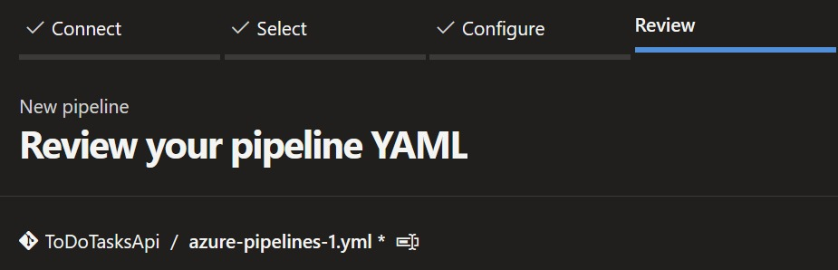
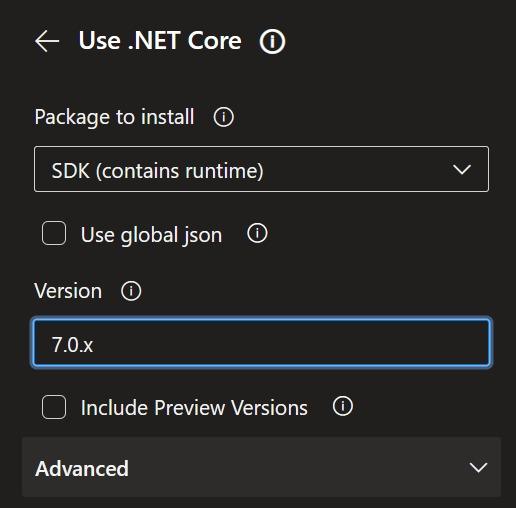
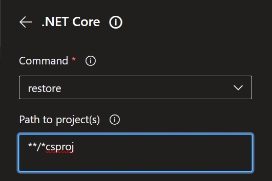
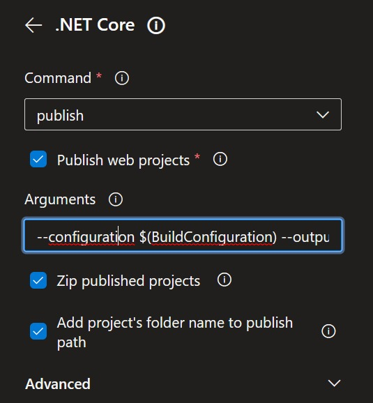
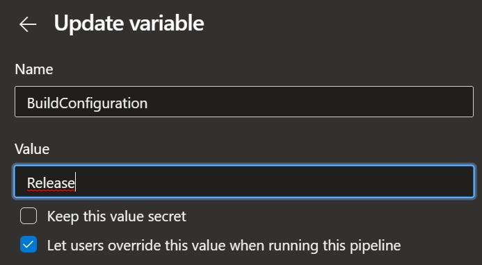
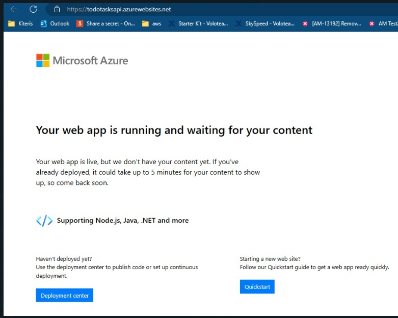
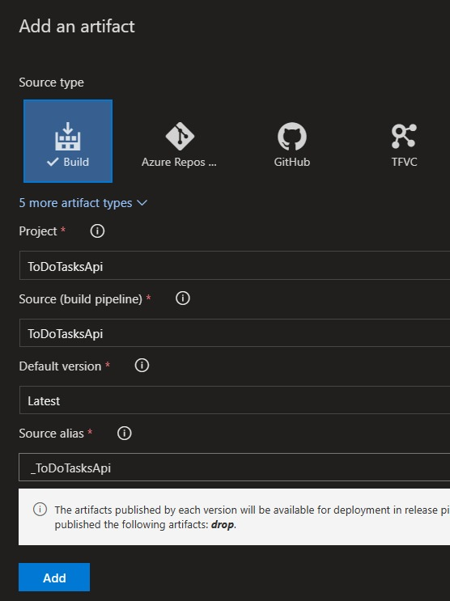
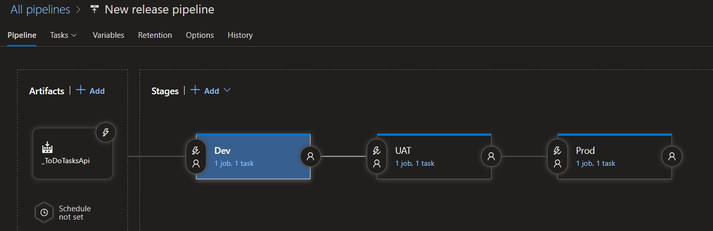
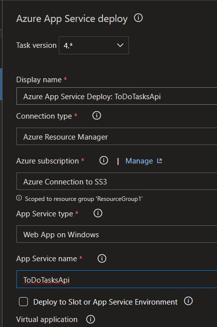
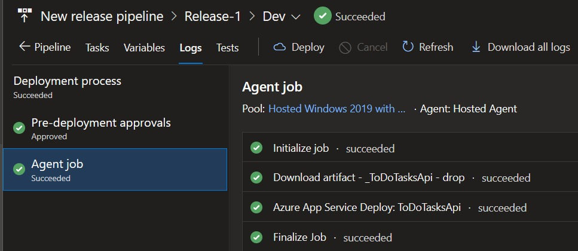

# ToDoTasks Api Project
The ToDoTasks project is an API developed in .NET 7, implementing a DDD architecture and making use of a SqLite database.
The purpose of the project is to provide a list of tasks that can be viewed, created, modified, deleted, and filtered by "status" and "dates" as needed.

## Desarrollo
- **Research** - 30% of the development time was dedicated to research tasks since .NET 7 is quite recent and brings interesting updates.
- **Development** - 60% of the development time was dedicated to pure development, implementing the architecture, endpoints, logic, and database configuration.
- **Unit Tests and Documentation** - The remaining 10% was dedicated to performing unit testing and documentation.

## Aplicación
- **ToDoTask.Web.Api** The developed application is responsible for keeping the task data up-to-date and available through its endpoints.

# Application Design
## Architecture
The architecture used for the development of the application is Domain-Driven Design, which is a set of patterns, principles, and practices that help us understand and solve business problems in the design of object-oriented systems.
 

# Tech Stack
### Technologies used in **Trading.Web.Api**
- ASP.NET Core 7.0
- ASP.NET Web Api
- AutoMapper
- Swagger UI
- SQLite
- Entity Framework
- Linq
  
### Design Patterns and SOLID principles
- Dependency Injection
- Repository Pattern
- Singleton

### Segurity
- Cors

# Globals Prerequisites
- Visual Studio 2022 installed with .Net 7.0 version
- SQLite extension installed.

# Instalation 🔧
Perform a build by right-clicking on the project solution in Visual Studio and selecting the "Build Solution" option. 
This is done to verify that the code compiles correctly and that the dependencies are installed correctly.

The local deployment is configured to create a SQLite database by creating a file named 'ToDoTaskDb.db' where tables are created based on the model specified in the configuration.

# Run
When running the application with 'IIS Express', a Microsoft web application server that allows you to develop and test websites locally, the database is generated if it does not exist.
Through Swagger, requests can be sent to the database.

# TODO
- [ ] MediatR Pattern
- [x] Response wrapper
- [x] Async/Await
- [x] REST
- [x] Mapping (AutoMapper)
- [x] RemoveHeader
- [x] API Specification, API Definition (Swagger)
- [x] CORS
- [x] Pagination
- [x] Unit Testing
- [x] API Versioning with Swagger
- [x] Authentication Api with CQRS
- [x] Scoped over Transient
- [x] Use `abstract` keyword to appropriate class
- [x] Use `IQueryable`, `IEnumerable`, `IList` interfaces
- [x] Migration, Scaffold
- [ ] Error Handling, Global Exception
- [ ] Generic Repository
- [ ] Common: Constants, Helpers 
- [ ] Middleware
- [ ] Validation (FluentValidation)
- [ ] Transaction (Unit of Work)
- [ ] XSS injection
- [ ] Logging
- [ ] Microservices, API Gateway
- [ ] Task scheduling & Queues
- [ ] RabbitMQ
- [ ] serilog gmail

# References 📖

* [.Net](https://learn.microsoft.com/en-us/dotnet/core/introduction/)
* [Inserción de Dependencias](https://learn.microsoft.com/es-es/aspnet/core/fundamentals/dependency-injection?view=aspnetcore-7.0)
* [Middleware de ASP.NET Core](https://learn.microsoft.com/es-es/aspnet/core/fundamentals/middleware/?view=aspnetcore-7.0) 

* [Configuración en ASP.NET Core](https://learn.microsoft.com/es-es/aspnet/core/fundamentals/middleware/?view=aspnetcore-7.0)
* [Enrutamiento en ASP.NET Core](https://learn.microsoft.com/es-es/aspnet/core/fundamentals/routing?view=aspnetcore-7.0)
* [Controlar errores en ASP.NET Core](https://learn.microsoft.com/es-es/aspnet/core/fundamentals/error-handling?view=aspnetcore-7.0)
* [HttpRequest](https://learn.microsoft.com/es-es/aspnet/core/fundamentals/http-requests?view=aspnetcore-7.0)

# Azure devOps CI 🔧
## Log in to Azure organization and go to the project.
## In the Pipelines section, create a new pipeline by choosing the source code location and authorizing access.
## Choose 'Empty job' to configure the pipeline to your liking.
## 

## We need to make sure that we are using the .NET 7.0 SDK
## 

## After selecting the SDK, the three .NET Core commands 'restore', 'build', and 'publish' are entered. In the first two, '**/*csproj' is passed as the 'pathToProject' parameter. These commands are added to the pipeline.
## 

## In the 'publish' command, a configuration and a variable are added, leaving the checkbox for published projects.zip.
## 

## The 'BuildConfiguration' variable must have the value 'release'. Once the variables have been checked, the pipeline is ready for execution.
## 

# Azure devOps CD 🔧
## Make sure the Web App Service is available in Azure before pointing to it.
## 

## The first step to ensure continuous delivery is to set up a new Azure service connection to obtain subscription.
## 

## Generate a new 'Release Pipeline' with an empty job.
## In the Artifact section, add the path to the .zip file generated by the CI pipeline.
## 

## Once it is deployed to an environment, a permissions trigger is activated to continue deploying to other environments.
## Each stage is an environment with its own rules and security.
## 

## Configure the service deploy with the correct data, in this case, the 'dev' environment is shown.
## 

## Save the configuration of the 'Release Pipeline' and set it to execute automatically every time the CI pipeline is successfully executed.
## 

# Application Deployed.